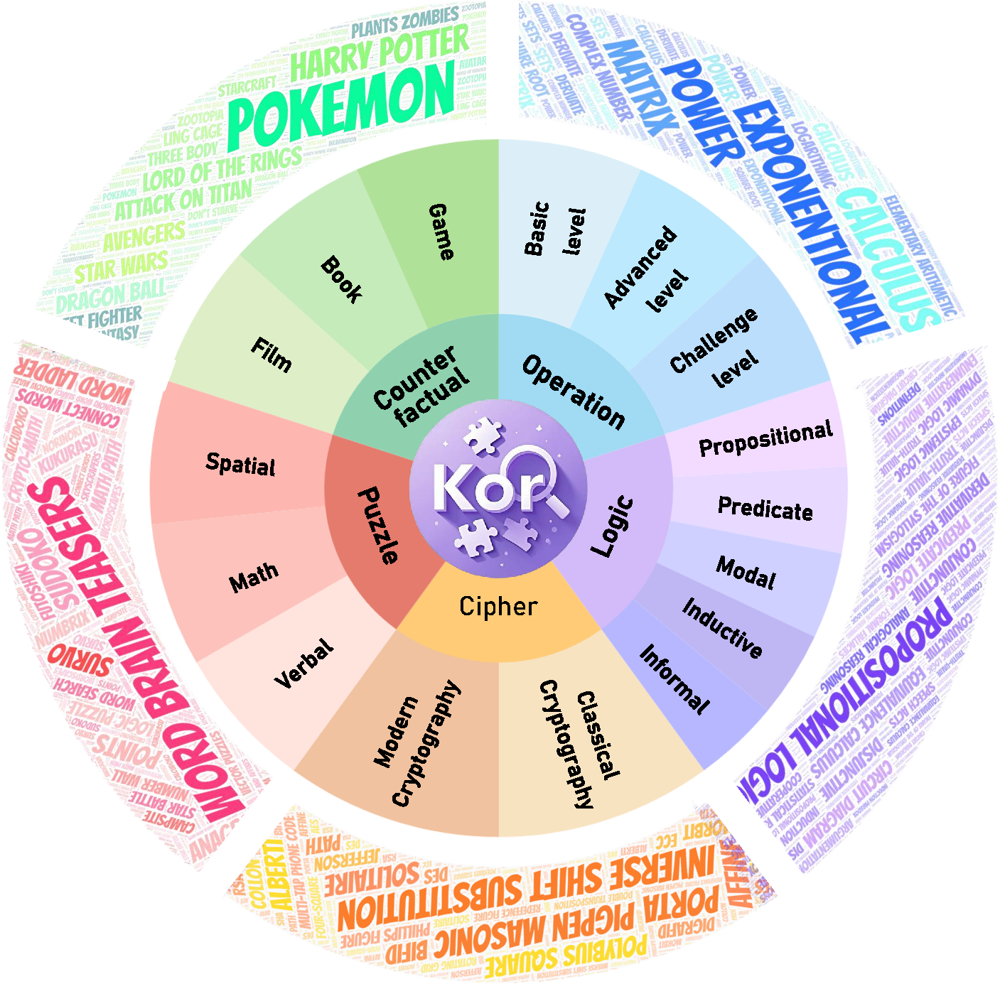

<h2 align="center" style="font-size: 2.5em; font-weight: bold; color: #2c3e50;">
  KOR-Bench: Benchmarking Language Models<br>
  on Knowledge-Orthogonal Reasoning Tasks
</h2>

<p align="center">
  <a href="https://kor-bench.github.io/" style="margin: 0 10px;">🌐 Homepage</a> |
  <a href="https://huggingface.co/papers/" style="margin: 0 10px;">🤗 Paper</a> |
  <a href="https://arxiv.org/abs/2410.06526" style="margin: 0 10px;">📖 ArXiv</a> |
  <a href="https://kor-bench.github.io/#leaderboard" style="margin: 0 10px;">🏆 Leaderboard</a> |
  <a href="https://github.com/KOR-Bench/KOR-Bench" style="margin: 0 10px;">🐙 GitHub</a>
</p>

This repository contains the evaluation code for the paper "[KOR-Bench: Benchmarking Language Models on Knowledge-Orthogonal Reasoning Tasks](https://arxiv.org/abs/2410.06526)".

---

## 🔔 Introduction


<p align="center">
   
</p>


**Knowledge-Orthogonal Reasoning Benchmark (KOR-Bench)** is designed to evaluate models' intrinsic reasoning and planning abilities while minimizing interference from pretrained knowledge. It introduces new rules that are independent of prior knowledge, allowing for a more accurate assessment of how models adapt to novel rule-driven tasks. KOR-Bench consists of five task categories: **Operation**, **Logic**, **Cipher**, **Puzzle**, and **Counterfactual**. Leading models, such as **Claude-3.5-Sonnet** and **GPT-4o**, score around **58%** on this challenging benchmark.

---

## ⚙️ Installation 

To install the required packages, run:

```bash
# Prepare repository and environment
git clone https://github.com/KOR-Bench/KOR-Bench.git
cd ./KOR-Bench
pip install -r requirements.txt
```

---
## 🔍 Inference
You can directly perform inference on `<MODEL_NAME>` using the following command:

```bash
export PYTHONPATH=$(pwd)

# local model infer
python infer/infer.py --config <CONFIG_PATH> --split <TASKS> --mode <MODE> --model_name <MODEL_NAME> --output_dir <OUTPUT_DIR> --batch_size <BATCH_SIZE> --use_accel

# API calls
python infer/infer.py --config <CONFIG_PATH> --split <TASKS> --mode <MODE> --model_name <MODEL_NAME> --output_dir <OUTPUT_DIR> --num_workers <NUM_WORKERS>
```

Example:
```bash
export PYTHONPATH=$(pwd)

# local model infer
python infer/infer.py --config config/config.yaml --split logic cipher counterfactual operation puzzle --mode zero-shot --model_name Yi-1.5-6B-Chat --output_dir results --batch_size 250 --use_accel

# API calls
python infer/infer.py --config config/config.yaml --split logic cipher counterfactual operation puzzle --mode zero-shot --model_name gpt-4o --output_dir results --num_workers 16
```

*More examples can be found in the shell scripts of this repository.* 🔗

#### 📜Parameter Explanations for Inference Script 

- **`--config`**: Path to the configuration file.
- **`--split`**: Specify the task categories for evaluation.  
  Available options include:
  - `logic`
  - `cipher`
  - `counterfactual`
  - `operation`
  - `puzzle`
  - ...
  
  Multiple categories can be selected at once, separated by spaces.
  
- **`--mode`**: Choose from different evaluation modes (`zero-shot`, `three-shot`, etc.).  Default is to evaluate all modes.

- **`--infer_limit`**: Limit the number of problems processed during inference to save costs during API debugging. Defaults to unlimited.

- **`--use_accel`**: Enables acceleration options for faster inference. *All local model experimental results in the paper are inferred using vllm.*

- **`--num_workers`**: Set the number of concurrent processes (use for API calls; set to 1 for local models).

- **`--batch_size`**: Set the batch size for local model inference (use for local model infer; set to 1 for API calls).


#### 📝 Notes 

- During inference, a temporary file `.jsonl.tmp` will be saved. If the inference is unexpectedly interrupted, you can directly rerun the command to resume from the last checkpoint.
  
- After inference is complete, check the `response` field in the saved JSONL file in `output_dir`. This field should typically be of string type; if it is of dict type, the `error` field will contain error information. You can rerun the command to re-infer any issues that caused errors.


#### 🛠️ Run Custom Model 

- **`--model_name`**: This parameter must align with the filenames in the `infer/models` directory.  We have some built-in models available for direct selection.

- **Adding a Custom Model**:  
  If you want to add a **custom model** for testing, follow these steps:
  1. Refer to the files in the `infer/models` directory.
  2. Create and add a new `.py` file for your model.
  3. Update the configuration in [`__init__.py`](infer/models/__init__.py).

-  For more details, please check the documentation of the specific model you are adding.


---

## ⭐ Evaluation

**Before you begin:** To ensure accurate evaluation, please make sure to install the following packages:

1. **SymPy**: Required for handling symbolic mathematical computations.
2. **antlr4-python3-runtime (version 4.11)**: Needed for processing LaTeX format answers.

```bash
pip install sympy
pip install antlr4-python3-runtime==4.11
```
*If you are using an environment created from the requirements.txt file, no additional installation is needed, as these dependencies are already included.*

**Next Step:** After you finish inference and confirm there are no error messages, please run the answer parsing and evaluation pipeline as follows: 
```bash
export PYTHONPATH=$(pwd)

python eval/eval.py <source_folder> <target_root_folder> <csv_file>

# example:
python eval/eval.py results/0923_main eval/results/0923_main eval/results_0923_main.csv
```
Detailed evaluation results can be found in the `target_root_folder`.

## 📫 Contact
Kaijing Ma: mkj3085003@gmail.com

Xinrun Du: duxinrun2000@gmail.com

Ge Zhang: gezhang@umich.edu

## 📚 Citation

**BibTeX:**
```bibtex
@misc{ma2024korbenchbenchmarkinglanguagemodels,
title={KOR-Bench: Benchmarking Language Models on Knowledge-Orthogonal Reasoning Tasks}, 
author={Kaijing Ma and Xinrun Du and Yunran Wang and Haoran Zhang and Zhoufutu Wen and Xingwei Qu and Jian Yang and Jiaheng Liu and Minghao Liu and Xiang Yue and Wenhao Huang and Ge Zhang},
year={2024},
eprint={2410.06526},
archivePrefix={arXiv},
primaryClass={cs.DB},
url={https://arxiv.org/abs/2410.06526}, 
}
```
